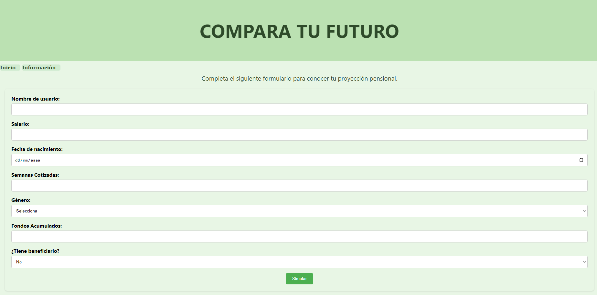

# Simulador Pensional

Este proyecto es una aplicación web que permite a los usuarios calcular y comparar escenarios de pensión en el régimen público y privado, en función de la nueva regulación. La aplicación está compuesta por un frontend desarrollado en React y un backend en Golang utilizando Gorilla.

## Arquitectura

La aplicación sigue una arquitectura de microservicios y está diseñada para ser desplegada en la nube mediante un enfoque basado en SOA (Service-Oriented Architecture). El backend proporciona una API REST para el cálculo y simulación de pensiones, mientras que el frontend ofrece una interfaz interactiva para que los usuarios ingresen sus datos y visualicen los resultados.


## Tecnologías Utilizadas

### Frontend

- React
- Tailwind CSS
- React Router

### Backend

- Golang
- Gorilla Mux (para routing)

### Infraestructura

- AWS CodePipeline (para CI/CD)
- AWS ECS o Kubernetes (para despliegue)
- Nginx o Traefik (para proxy inverso y balanceo de carga)
- Terraform (para infraestructura como código)

## Instalación y Configuración

### Requisitos Previos

- Node.js y npm
- Go instalado en el sistema

### Instalación del Backend

```sh
cd backend
go mod tidy
go run main.go
```

### Instalación del Frontend

```sh
cd frontend
npm install
npm run dev
```

## API Endpoints

### Simulación de Pensión

- `POST /simulation`: Enviar datos de usuario para simulación

## Despliegue

El despliegue se podria realizar mediante contenedores Docker y orquestación con AWS ECS o Kubernetes. Se puede automatizar con AWS CodePipeline y Terraform para gestionar la infraestructura.

```sh
docker-compose up --build
```

## Contribución

Si deseas contribuir, por favor abre un issue o un pull request en el repositorio.

## Licencia

This project is licensed under the Creative Commons Attribution-NonCommercial-ShareAlike 4.0 International (CC BY-NC-SA 4.0) license.


You are free to:


Share — copy and redistribute the material in any medium or format.


Adapt — remix, transform, and build upon the material.


Under the following terms:


Attribution — You must give appropriate credit, provide a link to the license, and indicate if changes were made. You may do so in any reasonable manner, but not in any way that suggests the licensor endorses you or your use.


NonCommercial — You may not use the material for commercial purposes.


ShareAlike — If you remix, transform, or build upon the material, you must distribute your contributions under the same license as the original.


Read more about this license at CC BY-NC-SA 4.0.
